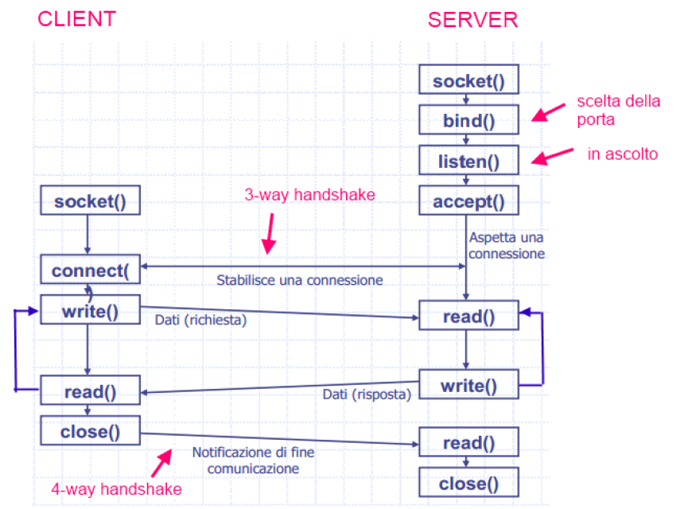

# Esempi Networking

## NetworkInterface & InetAddress

Programma per visualuzzare le informazioni su le interfacce di rete sul proprio PC, utilizzando le classi `java.net.NetworkInterface` e `java.net.InetAddress`: [io.checksound.networking.ShowMyNetwork](./src/io/checksound/networking/ShowMyNetwork.java).


## FETCH URL

Esempio [io.checksound.networking.FetchURL](./src/io/checksound/networking/FetchURL.java) per connetteri a una risorsa (Es: http://www.wikipedia.it) e leggere il contenuto della pagina HTML.

```java

URL url = new URL(urlString);
URLConnection connection = url.openConnection();
InputStream urlData = connection.getInputStream();
       
/* Copy lines of text from the input stream to the screen, until end-of-file is encountered  (or an error occurs). */

BufferedReader in;  // For reading from the connection's input stream.
in = new BufferedReader( new InputStreamReader(urlData) );

while (true) {
    String line = in.readLine();
    if (line == null)
        break;
    System.out.println(line);
}
in.close();

```

## SOCKET in C




| PRIMITIVA (usata da…) | AZIONE |
|-----------|--------|
|**SOCKET**  (clint/server) | Crea un punto di accesso relativo al servizio (endpoint) e restituisce un descrittore di socket che è simile ad un descrittore di file|
|**BIND** (server) | assegna l’indirizzo al socket creato e la porta prefissata. In genere viene eseguito solo sul server. Infatti la porta sul client è assegnata automaticamente dal Sistema Operativo |
|**LISTEN** (server) | Utilizzata per rendere il socket pronto ad accettare le richieste in arrivo. E’ un socket passivo, cioè non prende mai l’iniziativa. Specifica il numero delle connessioni che possono essere servite. E’ utilizzata solo dai server. |
|**ACCEPT** (server) | bloccante: arresta il mittente finchè non si realizza la connessione. Permette ad un server di prendere la prima richiesta presente nella sua coda di ricezione. Se la coda è vuota resta bloccato in attesa di una connessione. Un nuovo descrittore di socket è assegnato automaticamente appena la connessione è accettata|
|**CONNECT** (client)| Permette al client di aprire la connessione con il server. Il Sistema Operativo assegna automaticamente una porta. La funzione termina dopo la creazione della connessione. Blocca il client e attiva la procedura di connessione: al completamento il client viene sbloccato |
|**SEND** - Write (client/server) | Spedisce dati sulla connessione aperta |
|**RECEIVE** – Read (client/server) | Riceve dati sulla connessione aperta |
|**CLOSE** (client/server)| chiusura della connessione |

Codice in C, sulle socket: [echo_server.c](./src/echo_server.c) e [echo_client.c](./src/echo_client.c).
 
## SOCKET in JAVA

### SERVIZIO DATE

Il primo esempio: [io.checksound.networking.DateClient](./src/io/checksound/networking/DateClient.java) e [io.checksound.networking.DateServer](./src/io/checksound/networking/DateServer.java). Il client fa una connessione al server, legge una riga di testo inviata dal server, e mostra il testo a console. Il testo inviato dal server consiste nella data e time corrente sul computer dove il server è attivo.

### SERVIZIO ECHO

Client [io.checksound.networking.LineClient](./src/io/checksound/networking/LineClient.java) legge input da riga di comando, invia la richiesta al server su output stream e riceve la risposta dal server su input stream:

```java
public void startClient() throws IOException {
		Socket socket = new Socket(ip, port);
		System.out.println("Connection established");
		Scanner socketIn = new Scanner(socket.getInputStream());
		PrintWriter socketOut = new PrintWriter(socket.getOutputStream());
		Scanner stdin = new Scanner(System.in);
		try {
			while (true) {
				String inputLine = stdin.nextLine();
				socketOut.println(inputLine);
				socketOut.flush();
				String socketLine = socketIn.nextLine();
				System.out.println(socketLine);
			}
		} catch (NoSuchElementException e) {
			System.out.println("Connection closed");
		} finally {
			stdin.close();
			socketIn.close();
			socketOut.close();
			socket.close();
		}
	}
```

Il server, [io.checksound.networking.EchoServer](./src/io/checksound/networking/EchoServer.java) in ascolto delle richieste del client dall'input a cui risponde sull'output stream:

```java
public void startServer() throws IOException {
		// apro una porta TCP
		serverSocket = new ServerSocket(port);
		System.out.println("Server	socket	ready on port:" + port);
		// resto in attesa di una connessione
		Socket socket = serverSocket.accept();
		System.out.println("Received client	connection");
		// apro gli stream di input e output per leggere
		// e scrivere nella connessione appena ricevuta
		Scanner in = new Scanner(socket.getInputStream());
		PrintWriter out = new PrintWriter(socket.getOutputStream());
		// leggo e scrivo nella connessione finche'non
		// ricevo "quit"
		while (true) {
			String line = in.nextLine();
			if (line.equals("quit")) {
				break;
			} else {
				out.println("Received:	" + line);
				out.flush();
			}
		}
		// chiudo gli stream e il socket
		System.out.println("Closing	sockets");
		in.close();
		out.close();
		socket.close();
		serverSocket.close();
    }
```

## ECHO SERVER MULTITHREAD

Versione del server che accetta più connessioni da più client 
(versione con multithead, per gestire le richieste di più client contemporaneamente): 
[io.checksound.networking.MultiEchoServer](./src/io/checksound/networking/MultiEchoServer.java) e 
[io.checksound.networking.EchoServerClientHandler](./src/io/checksound/networking/EchoServerClientHandler.java).

## DATAGRAM

Comunicazione tramite socket UDP.

Tutorial: https://docs.oracle.com/javase/tutorial/networking/datagrams/index.html

Server [io.checksound.networking.udp.QuoteServer](./src/io/checksound/networking/udp/QuoteServer.java) e
[io.checksound.networking.udp.QuoteServerThread](./src/io/checksound/networking/udp/QuoteServerThread.java)

Client [io.checksound.networking.udp.QuoteClient](./src/io/checksound/networking/udp/QClient.java)

Il client invia la richiesta al server tramite un pacchetto di tipo `java.net.DatagramPacket` 
su una `java.net.DatagramSocket`.

Il server aspetta la richiesta su una `java.net.DatagramSocket`, 
in ascolto su una certa porta e 
una volta ricevuta la richiesta, invia una risposta come pacchetti 
`java.net.DatagramPacket`.

Il `DatagramPacket` quando ricevuto contiene l'indirizzo dell'host (specificato come `java.net.InetAddress`) e la porta del mittente.

Quando si vuole inviare un `DatagramPacket` bisogna specificare host e la porta del destinatario.

## MULTICAST

https://www.developer.com/java/data/how-to-multicast-using-java-sockets.html

Utilizzo di indirizzi di multicast

Il server [io.checksound.networking.multicast.MulticastServer](./src/io/checksound/networking/multicast/MulticastServer.java) e
[io.checksound.networking.multicast.MulticastServerThread](./src/io/checksound/networking/multicast/MulticastServerThread.java)

Il client [io.checksound.networking.multicast.MulticastClient](./src/io/checksound/networking/multicast/MulticastClient.java)

	